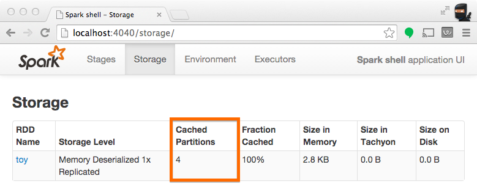

# 一个 RDD 有多少个分区？

在调试和故障处理的时候，我们通常有必要知道 RDD 有多少个分区。这里有几个方法可以找到这些信息：

## 使用 UI 查看在分区上执行的任务数

当 stage 执行的时候，你可以在 Spark UI 上看到这个 stage 上的分区数。 下面的例子中的简单任务在 4 个分区上创建了共 100 个元素的 RDD ，然后在这些元素被收集到 driver 之前分发一个 map 任务：

```scala
scala> val someRDD = sc.parallelize(1 to 100, 4)
someRDD: org.apache.spark.rdd.RDD[Int] = ParallelCollectionRDD[0] at parallelize at <console>:12

scala> someRDD.map(x => x).collect
res1: Array[Int] = Array(1, 2, 3, 4, 5, 6, 7, 8, 9, 10, 11, 12, 13, 14, 15, 16, 17, 18, 19, 20, 21, 22, 23, 24, 25, 26, 27, 28, 29, 30, 31, 32, 33, 34, 35, 36, 37, 38, 39, 40, 41, 42, 43, 44, 45, 46, 47, 48, 49, 50, 51, 52, 53, 54, 55, 56, 57, 58, 59, 60, 61, 62, 63, 64, 65, 66, 67, 68, 69, 70, 71, 72, 73, 74, 75, 76, 77, 78, 79, 80, 81, 82, 83, 84, 85, 86, 87, 88, 89, 90, 91, 92, 93, 94, 95, 96, 97, 98, 99, 100)
```

在 Spark 的应用 UI 里，从下面截图上看到的 "Total Tasks" 代表了分区数。


## 使用 UI 查看分区缓存

持久化(即缓存) RDD 时通常需要知道有多少个分区被存储。 下面的这个例子和之前的一样，除了现在我们要对 RDD 做缓存处理。操作完成之后，我们可以在 UI 上看到这个操作导致什么被我们存储了。

```scala
scala> someRDD.setName("toy").cache
res2: someRDD.type = toy ParallelCollectionRDD[0] at parallelize at <console>:12

scala> someRDD.map(x => x).collect
res3: Array[Int] = Array(1, 2, 3, 4, 5, 6, 7, 8, 9, 10, 11, 12, 13, 14, 15, 16, 17, 18, 19, 20, 21, 22, 23, 24, 25, 26, 27, 28, 29, 30, 31, 32, 33, 34, 35, 36, 37, 38, 39, 40, 41, 42, 43, 44, 45, 46, 47, 48, 49, 50, 51, 52, 53, 54, 55, 56, 57, 58, 59, 60, 61, 62, 63, 64, 65, 66, 67, 68, 69, 70, 71, 72, 73, 74, 75, 76, 77, 78, 79, 80, 81, 82, 83, 84, 85, 86, 87, 88, 89, 90, 91, 92, 93, 94, 95, 96, 97, 98, 99, 100)
```

注意：下面的截图有 4 个分区被缓存。



## 编程查看 RDD 分区

在 Scala API 里，RDD 持有一个分区数组的引用， 你可以使用它找到有多少个分区：

```scala
scala> val someRDD = sc.parallelize(1 to 100, 30)
someRDD: org.apache.spark.rdd.RDD[Int] = ParallelCollectionRDD[0] at parallelize at <console>:12

scala> someRDD.partitions.size
res0: Int = 30
```

在 Python API 里, 有一个方法可以明确地列出有多少个分区：

```python
In [1]: someRDD = sc.parallelize(range(101),30)

In [2]: someRDD.getNumPartitions()
Out[2]: 30
```

注意：上面的例子中，是故意把分区的数量初始化成 30 的。

[阅读原文](http://databricks.gitbooks.io/databricks-spark-knowledge-base/content/performance_optimization/how_many_partitions_does_an_rdd_have.html)
